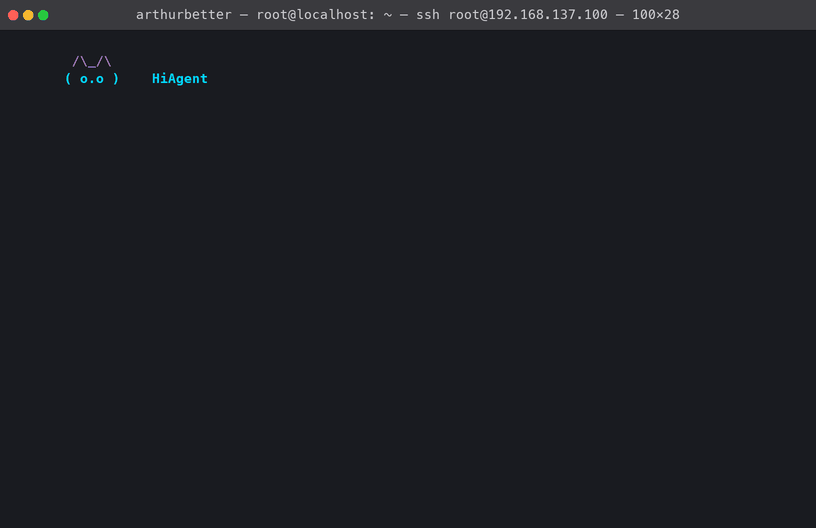

# pico-minicpm5

[中文说明](README.zh-CN.md) · [Board demo](app/README.md) · [板端 Demo](app/README.zh-CN.md)



One board session, played at the speed it actually ran. Nothing is sped up and
nothing is cut, so the numbers on screen are the ones the board produced.

The model answers a greeting `3.2 s` after the prompt, because a turn that
needs no tool is disclosed no tool schema. Writing a file does need one, and
that is the slow turn: `395` prompt tokens at `79.5 ms` each, which the spinner
counts down rather than hides. The two turns after it never reach the model —
the directory listing takes `1.8 ms` and `swish(2)` takes `0.7 ms`, computed in
Python because the model gets that particular number wrong. The listing is also
the check on the write: `a.txt` is in it.

`pico-minicpm5` turns the pinned
[`openbmb/MiniCPM5-1B`](https://huggingface.co/openbmb/MiniCPM5-1B)
checkpoint into a reproducible Hi3403/PICO deployment:

```text
Hugging Face checkpoint
        │ verify revision, config, index and safetensors contract
        ▼
24 real-weight decoder-layer ONNX graphs + vocabulary-head ONNX
        │ prefix every layer, chain hidden by SSA, share mask/RoPE
        ▼
one prefill ONNX + one decode ONNX with packed K/V (5 public inputs / 3 outputs)
        │ ATC/DDK supplied by the user
        ▼
prefill.om + decode.om + head_flat.om
        │ manifest, checksums and numeric qualification
        ▼
three-handle Hi3403 release bundle
```

The production merge is **graph composition before compilation**. It is not
byte concatenation of independently compiled OM files. The historical binary
linker is deliberately excluded from the default pipeline and is documented
only as an experimental, fail-closed recovery path.

## Status

`v0.2.1` adds runtime contracts for five decode contexts. Qualification
numbers below were measured on **Euler Pi** (commercial
`SS928V100_SDK_V2.0.2.2`). The same `ctx1024` OM bundle is gated on
**Orange Pi AIfly** (community Pegasus / Jammy) with the **same**
`chat.sh --prompt '只回复 PICO_OK' --max-new 8` record: identical token ids,
identical text, `CHAT_EXIT=0`. Two-board matrix:
[`app/README.md`](app/README.md). Long-context OM files remain
owner-supplied artifacts; the source release does not redistribute weights,
licensed libraries or locally compiled models.

| Profile | p50 / token | token/s | Prompt ingestion | Status |
|---|---:|---:|---:|---|
| ctx1024 | 100.40 ms | **9.96** | 79.49 ms/token | qualified |
| ctx4096 | 127.96 ms | **7.81** | 106.28 ms/token | qualified |
| ctx8192 | 165.71 ms | **6.03** | 146.82 ms/token (4097-token gate) | qualified |
| ctx10240 | 185.78 ms | **5.38** | 166.26 ms/token (4097-token gate) | pending |
| ctx16384 | 242.51 ms | **4.12** | 222.25 ms/token (4097-token gate) | pending |

The contexts differ only in `decode.om`. Every profile bootstraps position zero
on the same frozen `ctx1024` `prefill.om` and shares one `head_flat.om`, byte
for byte — the mixed prefill-window contract. Their measured position-zero
transformer times agree to `0.39 ms`, which is that contract showing up in the
timing.

What each profile passed:

- `ctx1024`: prefill and decode minimum public-output cosine `0.996646` and
  `0.998023`; `48/48` greedy tokens against the official-checkpoint FP64 oracle;
  `2.03x` the accepted 49-handle baseline (`4.89–4.92 token/s`).
- `ctx4096`: minimum public-output cosine `0.990820` at position 4095, board
  tail byte-exact with the simulator, `48/48` greedy tokens, boundary
  fail-closed. Gate record `release/contexts/ctx4096.qualification.json`.
- `ctx8192`: minimum public output `0.986076`, 48/48 greedy tokens, corrected
  period-plus-EOS exact, 4097-token head-skip and live-memory/JSONL gates PASS.
- `ctx10240`: long prompt, EOS and operational gates pass, but the greedy suite
  is 36/48 and tail hidden cosine is `0.978842`; it remains pending.
- `ctx16384`: short greedy/EOS and long-prompt operational gates pass, but the
  best recalibrated tail hidden/K/V is `0.957146/0.985295/0.967172`; it remains
  pending.

EOS terminates cleanly on all three and the 48-token oracle passes on all
three. Measured against the re-derived FP64 reference, `ctx8192` reproduces the
reference exactly while `ctx1024` and `ctx4096` stop one token earlier, omitting
a terminal period — non-blocking, and explained in
[the strict-EOS note](release/contexts/strict-eos-oracle.md).

Long prompts are the weak point: tokens are still fed in one at a time, so a
512-token prompt costs about `41 s` on ctx1024. The fail-closed native-prefill
planner already implements the `S128 -> S32 -> S16 -> strict S1 tail` policy
that would amortise this and exposes its decision per request, but only S1 is
enabled — no wide block has passed a numeric gate. See
[the native prefill contract](docs/NATIVE_PREFILL_SCHEDULER.md) and
[the performance board](release/perf/README.md).

These are Hi3403 measurements on the recorded configuration, not a claim about
every Hi3403 product. The upstream checkpoint advertises a much longer context;
what this release fixes at `1024` is the prefill window, not the context.

## Deploy the prebuilt Hi3403 demo

A deployment is assembled from three releases, because the model files did not
change and are not re-uploaded:

| From | What | Why |
|---|---|---|
| [`v0.2.1`](https://github.com/GitBubble/pico-minicpm5/releases/tag/v0.2.1) | source distributions, SBOM, long-context runtime/profile code | source-only; no OM redistribution |
| [`v0.2.0`](https://github.com/GitBubble/pico-minicpm5/releases/tag/v0.2.0) | runtime archive, `SHA256SUMS` | carries the `app/` board application and executor `cef4edb2…` |
| [`v0.1.0`](https://github.com/GitBubble/pico-minicpm5/releases/tag/v0.1.0) | `prefill.om`, `decode.om`, `head_flat.om`, token embedding, tokenizer | byte-identical in `v0.2.0`, so they stay where they are |
| [`v0.1.0-ctx-preview`](https://github.com/GitBubble/pico-minicpm5/releases/tag/v0.1.0-ctx-preview) | `decode.ctx4096.om`, `decode.ctx8192.om` | only needed for the extended-context profiles |

Take the runtime from `v0.2.0`. The `v0.1.0` runtime archive carries the older
executor, which its own shipped source could not rebuild; `v0.2.0` pins one that
[`docs/EXECUTOR_BUILD.md`](docs/EXECUTOR_BUILD.md) reproduces byte for byte.

```bash
mkdir pico-minicpm5-deployment-v0.2.0
cd pico-minicpm5-deployment-v0.2.0

gh release download v0.2.0 --repo GitBubble/pico-minicpm5 \
  --pattern 'pico-minicpm5-runtime-v0.2.0.tar.gz' --pattern 'SHA256SUMS'
gh release download v0.1.0 --repo GitBubble/pico-minicpm5 \
  --pattern 'prefill.om' --pattern 'decode.om' --pattern 'head_flat.om' \
  --pattern 'token_embedding.f16.bin' --pattern 'tokenizer.json'

sha256sum -c --ignore-missing SHA256SUMS

tar xzf pico-minicpm5-runtime-v0.2.0.tar.gz --strip-components=1
mkdir -p models assets
mv prefill.om decode.om head_flat.om models/
mv token_embedding.f16.bin tokenizer.json assets/
```

Verify before moving anything: `SHA256SUMS` names the files as downloaded, and
it also lists this release's Python distributions and SPDX document, which this
recipe does not fetch — hence `--ignore-missing`.

For `ctx4096`, add its decode OM and select the profile at startup. The extended
contexts are covered by their own checksum file, not by the one above:

```bash
gh release download v0.1.0-ctx-preview --repo GitBubble/pico-minicpm5 \
  --pattern 'decode.ctx4096.om' --pattern 'SHA256SUMS.ctx-preview'
sha256sum -c --ignore-missing SHA256SUMS.ctx-preview
mkdir -p models/ctx4096 && mv decode.ctx4096.om models/ctx4096/decode.om
```

Copy the assembled directory to the board and start the demo:

```bash
tar cf - . | ssh root@BOARD_IP \
  'mkdir -p /opt/pico-minicpm5 && tar xf - -C /opt/pico-minicpm5'
```

Which board, which SDK, and which bring-up to run after the copy is in
[`app/README.md`](app/README.md) (Euler Pi commercial vs Orange Pi AIfly
community). Short form:

| Board | SDK | After copy |
|---|---|---|
| Euler Pi 2.0 | SS928V100_SDK_V2.0.2.2, Linux 4.19.90 | `install_board.sh` / `prepare_npu.sh` |
| Orange Pi AIfly | Pegasus / Jammy `6.6.86-hi3403` | `prepare_community.sh` + glibc 2.39 sidecar |

## Euler Pi factory image: unload pqp, then load SVP NPU

The qualified board numbers are Hi3403 / SS928. The Ebaina **Euler Pi 2.0**
factory Linux image runs `load_ss928v100 -i` from `/etc/init.d/S90autorun` and
inserts `ot_pqp.ko`. That module is mutually exclusive with `ot_svp_npu.ko` —
the vendor script says so — so `/dev/svp_npu` never appears and the three
handles cannot execute.

On this board an interactive SSH login should report:

| Field | Value |
|---|---|
| Product | Euler Pi |
| Chip | SS928V100 |
| SDK | SS928V100_SDK_V2.0.2.2 |
| Hardware | HiEuerPI_V1.2 |
| Software | V2.0 |
| Kernel | 4.19.90 aarch64 |
| Factory login | `root` / `ebaina` (Euler Pi quick-start manual) |
| USB link | host `192.168.137.1/24`, board may add `192.168.137.100/24` |

On a fresh factory board, one host command is enough (USB NIC already
`192.168.137.1`, stage tree assembled):

```bash
./app/bringup_euler_pi.sh \
  --stage /tmp/pico-minicpm5-board-stage \
  --iface en8 --board-ip 192.168.137.100 --smoke
```

It finds the peer, logs in as `root` / `ebaina`, adds `192.168.137.100`,
copies the tree (including `app/lib`), unloads pqp / loads the NPU, installs
Python if needed, and smokes `chat.sh`.

After the copy, you can also run the installer once. It unloads `pqp`, loads the NPU,
persists that swap after `S90autorun`, and prints the environment on the next
interactive SSH login:

```bash
ssh root@BOARD_IP \
  '/opt/pico-minicpm5/app/install_board.sh --usb-ipv4 192.168.137.100/24'
```

Module swap only, no boot hook or login banner:

```bash
ssh root@BOARD_IP /opt/pico-minicpm5/app/prepare_npu.sh
ssh root@BOARD_IP /opt/pico-minicpm5/app/board_env.sh
```

`chat.sh` / `agent.sh` call `prepare_npu.sh` again if `/dev/svp_npu` is missing
and the vendor `svp_npu` ko directory exists. A reboot still needs the
`/etc/init.d/S91pico_npu` hook written by `install_board.sh`, or `S90autorun`
will reload `ot_pqp`.

## Euler Pi factory image: install Python 3 from the host

Factory Linux has **no** `python3`, no `pip`, and no `opkg`/`apt`. glibc is
`2.29`, so an Ubuntu 3.10 `.deb` will not drop in. `chat.sh` needs CPython
3.10 plus `tokenizers`; the OpenClaw preview also needs `jinja2`.

Run this on the **host**, not on the board:

```bash
# after the deployment tree is already on /opt/pico-minicpm5
./app/install_python.sh --board root@192.168.137.100
```

It downloads pinned `cpython-3.10.21+20260814` aarch64
`install_only_stripped` (glibc ≥ 2.17) and manylinux aarch64 wheels for
`tokenizers` / `jinja2` / `MarkupSafe`, checks SHA-256, and unpacks to
`/opt/pico-minicpm5/venv`. `chat.sh` prefers `$ROOT/venv/bin/python`.

If GitHub or PyPI is slow:

```bash
PICO_GITHUB_MIRROR=https://ghfast.top \
PICO_PYPI_INDEX=https://pypi.tuna.tsinghua.edu.cn \
  ./app/install_python.sh --board root@192.168.137.100
```

Stage only, then copy yourself:

```bash
./app/install_python.sh --stage /tmp/pico-board-python --skip-upload
tar cf - -C /tmp/pico-board-python venv \
  | ssh root@192.168.137.100 'tar xf - -C /opt/pico-minicpm5'
```

Check on the board:

```bash
ssh root@192.168.137.100 \
  '/opt/pico-minicpm5/venv/bin/python -c "import tokenizers,jinja2; print(tokenizers.__version__)"'
```

Do not `apt install python3` on this rootfs. Do not use `manylinux_2_34`
wheels that need glibc 2.34+.

## Euler Pi factory image: SVP ACL runtime ships in the app

The executor linked by `chat.sh` needs `libsvp_acl.so`, not factory
`/opt/lib/npu/libascendcl.so`. The four objects live in `app/lib/`, taken
from `SS928V100_SDK_V2.0.2.2`. Copy the deployment tree onto the board; do
not hunt the SDK again:

| File | Role |
|---|---|
| `app/lib/libsvp_acl.so` | SVP ACL |
| `app/lib/libsvp_aicpu.so` | AICPU |
| `app/lib/libprotobuf-c.so.1` | protobuf-c |
| `app/lib/libsecurec.so` | bounds-checked C |

`chat.sh` prefers `$APP/lib`. Check:

```bash
ssh root@192.168.137.100 \
  'cd /opt/pico-minicpm5/app/lib && sha256sum -c SHA256SUMS'
```

Only if you must refresh from another SDK tree:

```bash
./app/install_runtime_lib.sh --sdk-root /path/to/SS928V100_SDK_V2.0.2.2
```

## Community SDK (Orange Pi AIfly / Pegasus)

Board matrix and the verified chat-smoke numbers live in
[`app/README.md`](app/README.md). AIfly is Ubuntu 22.04 (glibc **2.35**);
community `libsvp_aicpu.so` needs `fmod@GLIBC_2.38`. Python keeps the
system libc. Only the executor process runs under `app/glibc239/`
(Ubuntu 24.04 `libc6` 2.39). `chat.sh` launches
`pico_persistent_acl_executor.community` which execs that loader around
`community.bin` (Pegasus `libsvp_acl.a` + `libss_mpi.a` linked on the
board).

Graphics and inference cannot coexist. `prepare_community.sh` stops
LightDM and SIGTERMs `sample_gfbg` (its own handler runs
`sample_comm_sys_exit()`). `kill -9` and `rmmod ot_vo` hang the board.
Set `BUILD_DESKTOP=no` so `orangepi-hardware-optimization` does not
restart the desktop; `load_hi3403` must then skip `ot_tde` / `ot_vo` /
`gfbg` / HDMI, otherwise ACL `malloc_fix_addr` hits framebuffer slabs at
the MMZ base. `libpico_mmz_anyaddr.so` still rewrites `IOC_MMB_ALLOC_V3`
when the requested start is below the zone.

USB IPv4 is not factory-static. Host NIC `192.168.138.1`:

```bash
./app/configure_orangepi_usb_ipv4.sh --iface en10 --board-ip 192.168.138.10
```

```bash
tar cf - -C /tmp/pico-minicpm5-board-stage . \
  | ssh orangepi@192.168.138.10 'echo orangepi | sudo -S tar xf - -C /opt/pico-minicpm5'

ssh -t orangepi@192.168.138.10 \
  'echo orangepi | sudo -S /opt/pico-minicpm5/app/prepare_community.sh'
ssh -t orangepi@192.168.138.10 \
  'cd /opt/pico-minicpm5 && echo orangepi | sudo -S env TOKENIZERS=/opt/pico-minicpm5/pylib PYTHON=python3 ./app/chat.sh --prompt "只回复 PICO_OK" --max-new 8'
```

Do not point this board at commercial `app/lib` (`svp_acl_init ret=100000`).

The runtime archive keeps the executor in `app/bin/` and its source in
`app/native/`. `app/lib/` is the board OM runtime, not ATC/DDK. Override
`TOKENIZERS` if the board's `tokenizers` package lives outside the venv.

```bash
ssh root@BOARD_IP '/opt/pico-minicpm5/app/chat.sh'
ssh root@BOARD_IP '/opt/pico-minicpm5/app/chat.sh --profile ctx4096'
```

If the release files are already present on the board, skip all host-side
steps and follow [`app/README.md`](app/README.md). The shortest board command
is:

```bash
cd /opt/pico-minicpm5
./app/chat.sh       # plain conversational REPL
./app/agent.sh      # tool-calling agent
```

`chat.sh` starts a colour-aware conversational REPL using the official
MiniCPM5 chat template without tools. `agent.sh` starts
the resident agent at the default `ctx1024`, using the
official MiniCPM5 `<tools>/<function>/<tool_response>` protocol. It includes
workspace read/search/git tools plus approval-gated write/shell tools, a
MiniCPM ASCII pet, timed planning/tool feedback and streaming final answers.
Commands include `/tools`, `/think on|off`, `/permissions`, `/context`,
`/clear`, `/max N` and `/quit`. Thinking is off by default; start with
`./app/agent.sh --thinking` or toggle it without reloading the models. The two
entry points use the same three resident OM handles but remain
separate applications. For a one-shot completion use
`./app/chat.sh --prompt 'The capital of France is' --max-new 16`.
The explicit `--prompt` and `--interactive` options retain the legacy raw-text
completion mode for compatibility.

## Direct use and OpenClaw preview

The published `ctx1024` profile does **not** meet OpenClaw's 4096-token
local-model floor. It must not be advertised as an
OpenClaw-ready bundle. Users who have a separately deployed compatible service
can follow the detailed Chinese guide. The only currently documented native
JSONL path is the non-production C4096 split-runner preview; C8192 native OM to
OpenClaw is not yet closed:

- [MiniCPM5 服务接入 OpenClaw：普通用户使用指南（预览；当前无公开 OpenClaw-ready Asset）](docs/OPENCLAW_USAGE.zh-CN.md)

The guide starts with the safe text-only path, uses an isolated OpenClaw
profile, keeps the unauthenticated model endpoint on loopback, and records the
remaining native-OM and tool-call release blockers explicitly.

## Quick start

```bash
python -m venv .venv
. .venv/bin/activate
pip install -e '.[hub,onnx,reference,dev]'

# 1. Fetch the exact checkpoint. hf replaces the old huggingface-cli command.
pico-minicpm5 model fetch --local-dir work/model
pico-minicpm5 model verify --model-dir work/model

# 2. Capture float reference/calibration data from the official checkpoint.
pico-minicpm5 reference capture \
  --model-dir work/model --out work/reference --context 1024
pico-minicpm5 reference calibrate \
  --reference work/reference --family decode --out work/calibration/decode
pico-minicpm5 reference calibrate \
  --reference work/reference --family prefill --out work/calibration/prefill

# 3. Export actual-weight layer graphs and the dense vocabulary head.
pico-minicpm5 onnx export-layers \
  --model-dir work/model --out work/onnx/layers --context 1024
pico-minicpm5 onnx export-head \
  --model-dir work/model --out work/onnx/head/model.onnx

# 4. Compose the two independently calibrated 24-layer graph families.
pico-minicpm5 onnx compose \
  --layers-dir work/onnx/layers/decode --family decode \
  --out work/onnx/decode/model.onnx \
  --pack-input-kv --pack-output-kv --external-data
pico-minicpm5 onnx compose \
  --layers-dir work/onnx/layers/prefill --family prefill \
  --out work/onnx/prefill/model.onnx \
  --pack-input-kv --pack-output-kv --external-data

# 5. Compile with a locally installed/licensed ATC/DDK and custom-op library.
pico-minicpm5 build \
  --decode-onnx work/onnx/decode/model.onnx \
  --prefill-onnx work/onnx/prefill/model.onnx \
  --head-onnx work/onnx/head/model.onnx \
  --calibration work/calibration --out work/om \
  --context 1024 \
  --atc /path/to/atc \
  --custom-ops-lib /path/to/libsvp_custom.so

# 6. Run all three OMs with libinstsim or the Hi3403 runtime. Immediately after
# each completed run, capture the exact files from that run before scoring them.
pico-minicpm5 capture \
  --runner libinstsim --role prefill --position 0 --context 1024 \
  --om work/om/prefill.om \
  --build-manifest work/om/build-manifest.json \
  --output work/prefill/out.0.bin --output work/prefill/out.1.bin \
  --output work/prefill/out.2.bin \
  --report work/prefill/runtime-capture.json
pico-minicpm5 score \
  --output work/prefill/out.0.bin --output work/prefill/out.1.bin \
  --output work/prefill/out.2.bin --reference work/reference \
  --position 0 --context 1024 --om work/om/prefill.om \
  --build-manifest work/om/build-manifest.json \
  --capture-manifest work/prefill/runtime-capture.json \
  --report work/prefill-score.json

pico-minicpm5 capture \
  --runner libinstsim --role decode --position 1 --context 1024 \
  --om work/om/decode.om \
  --build-manifest work/om/build-manifest.json \
  --output work/decode/out.0.bin --output work/decode/out.1.bin \
  --output work/decode/out.2.bin \
  --report work/decode/runtime-capture.json
pico-minicpm5 score \
  --output work/decode/out.0.bin --output work/decode/out.1.bin \
  --output work/decode/out.2.bin --reference work/reference \
  --position 1 --context 1024 --om work/om/decode.om \
  --build-manifest work/om/build-manifest.json \
  --capture-manifest work/decode/runtime-capture.json \
  --report work/decode-score.json

# Feed decode's logical FP32 next_hidden at position 1 and an exactly-zero
# 1536-element FP32 residual to head_flat.om, then save its FP32 logits. The
# paths below must be the actual input/output files used in that same head run.
pico-minicpm5 capture \
  --runner libinstsim --role head_flat --position 1 --context 1024 \
  --om work/om/head_flat.om \
  --build-manifest work/om/build-manifest.json \
  --input hidden=work/head/pos1/next_hidden.f32.bin \
  --input residual=work/head/pos1/residual_zero.f32.bin \
  --output work/head/pos1/logits.f32.bin \
  --report work/head/pos1/runtime-capture.json
pico-minicpm5 score-head \
  --output work/head/pos1/logits.f32.bin \
  --reference work/reference --position 1 --context 1024 \
  --om work/om/head_flat.om \
  --build-manifest work/om/build-manifest.json \
  --capture-manifest work/head/pos1/runtime-capture.json \
  --hidden-input work/head/pos1/next_hidden.f32.bin \
  --residual-input work/head/pos1/residual_zero.f32.bin \
  --report work/head-score.json

# 7. Bind all three numeric gates to this exact ATC-built OM set, then release.
pico-minicpm5 qualify \
  --prefill-score work/prefill-score.json \
  --decode-score work/decode-score.json \
  --head-score work/head-score.json \
  --models work/om \
  --out work/qualification.json
pico-minicpm5 release assemble \
  --models work/om --model-dir work/model \
  --qualification work/qualification.json --out artifacts/release
pico-minicpm5 release verify artifacts/release
```

The head run must use the logical final hidden tensor produced for the same
`--position` as its logits reference. For example, the position-1 decode
hidden is scored against `pos1/layer_out_23.f32.bin`, then passed to
`head_flat.om`; the resulting logits are scored against
`pos1/logits.f32.bin`. Mixing a position-0 hidden with position-1 logits is an
invalid qualification even when tensor shapes happen to match. Qualification
also requires the head capture's `hidden` hash to equal the matching
transformer score's logical `next_hidden` hash, and requires `residual` to be
exactly 1536 FP32 zeros.

`capture` creates a local, auditable lineage record: it hashes the OM, ATC
build manifest and the named files from one completed `libinstsim` or
`ss928-board` run. Generate it immediately after that run, before files can be
replaced or mixed with another execution. It is not a cryptographic proof of
hardware execution or remote attestation; the operator remains responsible
for the truth of `--runner`. Every score command verifies this capture and
records the executed OM and build-manifest SHA256. `qualify` rejects reports
from another OM, another build, a fake compiler, or an unbound raw-output
capture.

Build, capture and scoring are explicitly fixed to `--context 1024` in this
release. `qualify` has no context override and rejects evidence from any other
context.

Only the three frozen hashes listed in `release/v0.1.0/release-manifest.json`
may reuse the recorded board verdict. Every newly compiled OM set requires an
explicit passing qualification file; regenerated calibration is intentionally
not treated as byte-identical to the historical accepted donor corpus.

Each external-data ONNX uses a dedicated empty directory. This preserves the
qualified one-file-per-initializer, offset-zero contract and prevents decode,
prefill or head exports from silently appending into one another's tensor data.

`model fetch` pins revision
`4e9de7a0778dc1c362e983e6858f0e77542cbdca`. Authentication, if ever
required, comes from `HF_TOKEN`; tokens are never accepted on the command line
or written to manifests.

## What is and is not in the source release

The source release contains the Python package, configs, schemas, tests and
documentation. It does not contain:

- checkpoint weights or weight-derived ONNX external-data files;
- OM binaries, token embeddings or copied tokenizer assets;
- ATC/DDK/libinstsim, Docker images or `libsvp_custom.so`;
  (`app/lib/` ships the four SVP ACL objects the board executor links)
- owner-controlled golden models, mapper dumps, calibration image lists,
  board addresses, credentials or raw logs.

The model card currently declares Apache-2.0, but generated model artifacts
remain separately identified as derived model assets. Users must also satisfy
the redistribution terms of their ATC/DDK and runtime installation.

See [docs/PIPELINE.md](docs/PIPELINE.md),
[docs/OM_COMPOSITION.md](docs/OM_COMPOSITION.md) and
[docs/RELEASE.md](docs/RELEASE.md) for the exact build/release contracts. The
[Agent routing and runtime-context profile design](docs/AGENT_ROUTING_AND_CONTEXT_PROFILES.md)
defines hybrid routing and the ctx128/1024/4096/8192 capability matrix; the
[native prefill scheduler](docs/NATIVE_PREFILL_SCHEDULER.md) defines the
`S128 -> S32 -> S16 -> S1` TTFT path and its activation gates. The
[quantization contract](docs/QUANTIZATION_CONTRACT.md) records how ATC's IFMR
search and the in-graph `Clip` bounds combine (`min(inferred, clip)`), and why
position zero needs its own calibration family. Euler Pi factory Linux needs
the NPU swap in "Euler Pi factory image" above before `/dev/svp_npu` exists.

## Development

```bash
pytest
pico-minicpm5 doctor
pico-minicpm5 release source --out artifacts
```

Public CI uses a tiny synthetic Llama fixture and a fake compiler. Checkpoint
download, ATC compilation, libinstsim and Hi3403 execution are opt-in local or
self-hosted jobs and must never upload private SDK material to a public cache.
