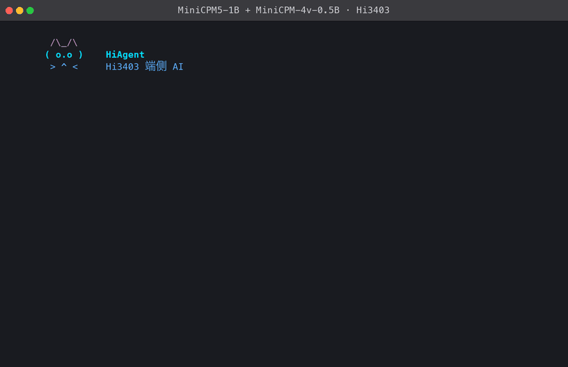

# 在 Hi3403 板端直接运行预编译 Demo

[English](README.md)

两次板端会话，都录自本目录的 `agent.sh`，真实硬件，按它们运行的速度播放。
没有加速，也没有剪辑。

**工具调用 —— 单模型**


一句问候、一次经显式批准的写文件、一次用来验证该写入的目录列举，
以及一个精确的 `swish(2)`。

**多模态 —— 两个模型同时在跑**



打招呼、看图、列目录。`描述一下 chart.png` 不需要模型做任何判断，所以主机在
`3.1 ms` 内直接路由，把作业交给 MiniCPM-4v-0.5B。描述在提示符行上逐词生长，
MiniCPM5-1B 全程可用，`21.4 s` 时答案自己落下来，用户没有按任何键。它读的那
张图是 [`docs/media/vision-demo.png`](../docs/media/vision-demo.png)，可以拿
描述去对。部署方式见下面的
[视觉章节](#视觉在-agent-旁边部署第二个模型)。

本目录是板端用户入口。以下步骤假设 `/opt/pico-minicpm5` 下已经装配好一套
部署——运行时归档取自 `v0.2.0` Release，模型文件取自 `v0.1.0`，装配方式见项目
README。直接运行不需要重新导出 ONNX、不需要
调用 ATC，也不需要在板端安装本项目的 host 构建包。

## 两块板、两套 SDK

同一套 `ctx1024` 三句柄（`prefill.om` / `decode.om` / `head_flat.om`，
`v0.1.0` 哈希）跑在两款 Hi3403 产品上。**OM 文件相同**，用户态和 NPU 拉起
方式不同。`chat.sh` 按镜像选择运行库（`/opt/ko/svp_npu` → 商业 Euler Pi；
Ubuntu Jammy / `/usr/lib/svp_npu` → 社区 AIfly）。

| | Euler Pi（商业 SDK） | Orange Pi AIfly（社区 SDK） |
|---|---|---|
| 产品 | Euler Pi 2.0，HiEuerPI_V1.2 | OPI AI Fly |
| 芯片 | SS928V100 / Hi3403 | SS928V100 / Hi3403 |
| SDK | **SS928V100_SDK_V2.0.2.2** | **Pegasus / AIfly**（`/usr/lib/svp_npu`，内核 `6.6.86-hi3403`） |
| 系统 | 出厂 Linux **4.19.90** aarch64 | Ubuntu **22.04 Jammy** |
| glibc | 2.29 | 系统 **2.35** + 执行器 sidecar **2.39**（`libc6_2.39-0ubuntu8.8`） |
| 登录 | `root` / `ebaina` | `orangepi` / `orangepi` |
| USB IPv4 | 主机 `192.168.137.1`，板 `192.168.137.100` | 主机 `192.168.138.1`，板 `192.168.138.10` |
| 运行库 | `app/lib/` + `pico_persistent_acl_executor.aarch64`（`cef4edb2…`） | `app/glibc239/` + `pico_persistent_acl_executor.community.bin`（`e4e2a449…`）+ 板载 `libsvp_*` + `libpico_mmz_anyaddr.so` |
| 拉起 | `prepare_npu.sh`（卸 `ot_pqp`，装 `ot_svp_npu`） | `prepare_community.sh`（停 LightDM，SIGTERM `sample_gfbg`；`BUILD_DESKTOP=no`） |

共用 ctx1024 门禁——**两块板同一条命令**，记录在
[`boards/ctx1024-pico-ok.json`](boards/ctx1024-pico-ok.json)：

```bash
./app/chat.sh --prompt '只回复 PICO_OK' --max-new 8
```

| | Euler Pi | Orange Pi AIfly |
|---|---|---|
| 加载 | 5.7 s | 3.1 s |
| `steps_ms` | 85.2–86.5（p50 **85.7**） | 79.3–81.8（p50 **80.6**） |
| Token ids | `[220, 34, 399, 48185, 84, 11552, 242, 10423]` | **相同** |
| 文本 | `\n- PICO_OK 是一个` | **相同** |
| `CHAT_EXIT` | 0 | 0 |

Euler 另外还有 v0.2.0 的 greedy 验收（`100.40 ms`/token，**9.96** tok/s，
`48/48`）以及 ctx4096/ctx8192 门。这些没有在 AIfly 上复跑。

不要混用两套用户态。商业 `app/lib` 在 12KB 社区 `ot_svp_npu` 上会
`svp_acl_init ret=100000`。社区 `libsvp_aicpu.so` 要 `fmod@GLIBC_2.38`，
Jammy 2.35 必须走 sidecar loader。AIfly 上图形（LightDM / `sample_gfbg`）
与推理不能共存——停用户态，不要 `rmmod gfbg`/`ot_vo`。

## 板端目录结构

```text
/opt/pico-minicpm5/
├── app/
│   ├── chat.sh
│   ├── agent.sh
│   ├── prepare_npu.sh
│   ├── board_env.sh
│   ├── install_board.sh
│   ├── install_python.sh
│   ├── install_runtime_lib.sh
│   ├── prepare_community.sh
│   ├── lib/{libsvp_acl.so,libsvp_aicpu.so,libprotobuf-c.so.1,libsecurec.so}
│   ├── lib-community/   # MMZ ioctl 改写 + Pegasus 辅库；Jammy / AIfly
│   ├── glibc239/        # Ubuntu 24.04 libc sidecar（仅执行器进程）
│   ├── bin/pico_persistent_acl_executor.aarch64          # Euler Pi
│   ├── bin/pico_persistent_acl_executor.community[.bin]  # AIfly + glibc239
│   ├── native/{Makefile,pico_persistent_acl_executor.c}
│   ├── profiles/{ctx128,ctx1024,ctx4096,ctx8192,ctx10240,ctx16384}.json
│   └── src/{merged_board_server.py,minicpm_agent.py,
│            minicpm_profile.py,
│            pico_minicpm5_split_board_runner.py,probe_om_execute_latency.py,
│            qualify_minicpm_greedy_chain.py}
├── models/{prefill.om,decode.om,head_flat.om}          # 已验收 ctx1024
├── models/ctx128/{prefill.om,decode.om}                # 验收后放入
├── models/ctx4096/decode.om                            # 已验收；prefill 共享 models/prefill.om
├── models/ctx8192/decode.om                            # 已资格化；prefill 同上共享
├── models/ctx10240/decode.om                           # pending；prefill 同上共享
├── models/ctx16384/decode.om                           # pending；prefill 同上共享
└── assets/{token_embedding.f16.bin,tokenizer.json}
```

视觉 skill 另外需要一棵可选的目录树，放在 agent 和 worker 都能读到的任意位置。
它不属于发布包：

```text
$VLM/{vision.om,resample.om,prefill_decode.om,token_emb.bin,tokenizer.json}
$QUEUE/                                    # 每条作业一个 JSON 文件；用到时自动创建
```

Euler Pi 用 `app/lib/`（见 `lib/README.zh-CN.md`）和 `.aarch64` 执行器。
Orange Pi AIfly 用 `app/glibc239/` 加上
`pico_persistent_acl_executor.community.bin`（静态链 Pegasus `libsvp_acl.a`
+ `libss_mpi.a`，在 2.39 loader 下跑）以及板载 `/usr/lib/svp_npu` AICPU。
`lib-community/libpico_mmz_anyaddr.so` 改写 `IOC_MMB_ALLOC_V3`，避免 OM
钉在已被 framebuffer 占用的 MMZ 基址。`chat.sh` 在 Jammy 上选这条路径。
厂方 `/opt/lib/npu` 是另一套 Ascend 库，不能替代。

Euler Pi 出厂 Linux 会装上 `ot_pqp.ko`，挡住 `/dev/svp_npu`，而且没有
`python3`。第一次部署请先跑 `./app/install_board.sh`，再在**主机**上跑
`./app/install_python.sh --board root@BOARD`（详见项目 README 的
「Euler Pi 出厂镜像」两节）。交互式 SSH 登录会打印 Chip / SDK / Hardware /
Software。

厂方 `search_tool` 每次开机按 `/opt/cfg/dev_info.config` 把 `eth0` 写成
`192.168.1.168/24`，一次性加的 `192.168.137.100` 会丢。
`install_euler_usbnet.sh` 改这份配置、装 `S93pico_usbnet`，并保持 IPv6。
IPv4/ARP 为 incomplete、USB 链路仍在时：

```bash
ping6 ff02::1%en8
ssh root@fe80::acea:fbff:fe30:daae%en8   # 密码 ebaina；地址是 eth0 的 EUI-64
# 然后: sh -s < app/install_euler_usbnet.sh
```

## 在 Euler Pi 上运行（商业 SDK）

```bash
cd /opt/pico-minicpm5
chmod +x app/*.sh app/bin/pico_persistent_acl_executor.aarch64
./app/install_board.sh --usb-ipv4 192.168.137.100/24

# MiniCPM5 官方无工具 chat template
./app/chat.sh

# 原生工具调用 Agent，三个模型句柄只加载一次
./app/agent.sh

# 显式选择 profile；ctx128 仅支持 Chat
./app/chat.sh --profile ctx128
./app/agent.sh --profile ctx4096
CONTEXT_PROFILE=ctx8192 ./app/agent.sh
```

## 在 Orange Pi AIfly 上运行（社区 SDK）

无桌面 NPU：`prepare_community.sh` 停 LightDM、对 `sample_gfbg` 发 SIGTERM，
并把 `BUILD_DESKTOP` 写成 `no`。`load_hi3403` 必须在该标志下跳过 `ot_tde` /
`ot_vo` / `gfbg` / HDMI，否则 ACL `malloc_fix_addr` 会撞上 MMZ 开头的
framebuffer。不要 `kill -9 sample_gfbg`，不要 `rmmod ot_vo`。

```bash
cd /opt/pico-minicpm5
sudo ./app/prepare_community.sh
sudo env TOKENIZERS=/opt/pico-minicpm5/pylib PYTHON=python3 \
  ./app/chat.sh --prompt '只回复 PICO_OK' --max-new 8
sudo env TOKENIZERS=/opt/pico-minicpm5/pylib PYTHON=python3 ./app/chat.sh
```

USB IPv4 出厂不固定。主机 AIfly 网卡已是 `192.168.138.1` 时：

```bash
./app/configure_orangepi_usb_ipv4.sh --iface en10 --board-ip 192.168.138.10
```

```text
        /\_/\
       ( o.o )    HiAgent
        > ^ <     Hi3403 端侧 AI
     本地运行 · 隐私安全 · 实时响应

⠹ Loading three resident model handles  6.4s
✓ ready · loaded 3 handles · ctx1024 · 7.4s
Agent ready · /help · /tools · /think on|off · /context · /clear · /quit
You ❯ 读取 README.md 的前 20 行并概括项目用途。
⠴ Planning  0.8s
⚙ read_file(path='README.md', start_line='1', end_line='20')
✓ read_file: 1: # pico-minicpm5
MiniCPM ✦ ...
You ❯ /quit
```

两个板端应用默认使用已验收的 `ctx1024` profile。`chat.sh` 使用 MiniCPM5 官方无工具 chat
template，并保留多轮历史直至 `/clear`；`agent.sh` 再加入下面描述的原生工具
协议。工具定义放在
`<tools>` 中，模型原生生成 `<function>/<param>` XML，执行结果通过
`<tool_response>` 回填；没有自定义另一套工具协议。Agent 会保留当前会话和
工具历史，`/clear` 可清空。模型句柄、executor 和板端缓冲区持续常驻，避免
每个问题重新加载约 10 秒。

内置工具为 `list_directory`、`read_file`、`search_text`、`git_status`、
`calculate`、`write_file` 和 `run_shell`；配置了视觉 worker 时还有
`describe_image`。前五项自动执行——`calculate` 只在
一套封闭的算术语言内求值，不碰文件系统、不起子进程、不解析自身表以外的任何
名字，因此比只读工具还弱。文件写入和 shell 每次都弹出
`Allow once? [y/N]`，默认拒绝。所有文件工具被限制在启动时的工作目录内，可用
`--workspace PATH` 显式指定边界。`/tools`、`/permissions` 和 `/context` 分别
显示工具、权限和 token 预算。

`describe_image` 把图片交给第二个模型——MiniCPM-4v-0.5B，跑在自己的进程里、
通过作业队列衔接——并立即返回作业号，而不是让本 REPL 为一张图阻塞 `21.5 s`。
描述会边生成边回流到提示符行上，完成后并入对话记录。给 `agent.sh` 和
`vision_worker.py` 都传 `--vision-queue PATH` 即可启用；不传则该工具完全不被
声明，所以没有视觉 worker 的板子不会为它花掉任何提示词 token。详见
[docs/MULTIMODAL_VISION.zh-CN.md](../docs/MULTIMODAL_VISION.zh-CN.md)。

`/help` 会按 Linux 命令行风格列出命令的语法、参数范围与作用域；使用
`/help COMMAND`（例如 `/help max`）可查看单个命令的详细说明。

| 命令 | 用途与使用范围 |
|---|---|
| `/help [COMMAND]` | 列出全部本地命令，或查看一个命令的详细帮助。 |
| `/profile` | 显示当前 runtime profile、context 和能力；切换需要重启。 |
| `/tools` | 只显示已注册的原生工具，不执行工具。 |
| `/permissions` | 显示哪些工具自动执行、哪些工具需要逐次授权。 |
| `/think [on\|off]` | 查看或切换后续 Agent 生成的 thinking。 |
| `/context` | 显示当前 profile 的 prompt 用量，包含工具定义和会话历史。 |
| `/clear` | 清空对话和工具历史但不重载模型句柄；`/reset` 是别名。 |
| `/max [N]` | 查看或设置 profile 配置的回答上限，实际仍受剩余上下文限制。 |
| `/quit` | 关闭常驻会话；`/exit` 和 Ctrl-D 等价。 |

Agent 已知配置的 workspace 根目录，并以 `path='.'` 表示该目录，因此应主动
调用工具检查，而不是向用户追问当前路径。明确的当前目录、目录列举、文件行窗口、
字面搜索和 Git 状态请求会直接路由到只读工具并显示 `model skipped`；总结、
转换与一般工具选择仍由模型完成。当前已验收
ctx1024 profile 的单次工具结果
限制为 800 字符，目录、文件与搜索默认窗口也相应缩小；需要更多信息时应缩小范围
或继续分页调用。

模型原生请求使用渐进式工具披露。明确只读任务只注入只读 schema；显式写入或
命令意图才增加对应的权限工具，模糊开发任务保留全量工具作为 fail-safe。成功
结果携带类型、本地引用、截断状态和下一 offset；`read_result_page` 可读取后续有界
分页而不重新执行原工具，会话保留最近 16 个结果。

Chat 和 Agent 默认复用 token-exact 的会话 resident K/V，后续轮次只执行新增
prompt token；`/clear` 会同时清空对话和 resident-prefix 元数据。可用
`REUSE_SESSION_KV=0 ./app/chat.sh` 或 `REUSE_SESSION_KV=0 ./app/agent.sh`
回到全量重放，便于对照诊断。板端两轮 Agent A/B 中，复用组与重放组的输出 token
完全一致，第二轮命中 134-token 前缀，耗时由 `94.94 s` 降至 `80.78 s`。类似
“第二行有什么作用”且已有上文证据的追问不会再注入无关工具 schema；修改和 shell
意图仍保持 fail-closed 的权限工具披露。

当前源码还提供按 schema 懒创建的固定 system/tool 前缀快照。新版 executor 通过
通用 resident-input snapshot/restore opcode 只保存实际使用的 K/V 行；切换工具
schema 或执行 `/clear` 后可在板内恢复，不把 cache 传回 Python。该路径已通过
板端 token-exact A/B 并在 Agent 中默认开启：恢复 137-token 前缀仅耗时
`1.76 ms`，同一条 32-token 请求由 `26.97 s` 降至 `12.56 s`（降低 `53.4%`），
生成 token ID 与文本完全一致。仅在全量重放诊断时使用
`FIXED_PREFIX_SNAPSHOTS=0 ./app/agent.sh` 关闭。

Agent 在达到 profile 的 `compact_at_tokens` 时执行确定性 context rebase：原始
工具输出被替换为带类型的本地引用，保留当前交换和最近对话，并按
`reserve_tokens` 留出回答空间。报告会记录压缩前后 token 数及被压缩轮数；若当前
交换本身仍无法放入 context，则 fail closed 并要求缩短输入或 `/clear`。Hi3403
长会话板端 A/B 的两轮都将 12 个旧工具轮次由 `2808` token 确定性压到 `810`，
并生成完全相同的 `[18655, 4569, EOS]`。重复运行命中 643-token resident 前缀，
总耗时由 `69.45 s` 降至 `14.61 s`（`4.75x`）。

已知 prompt token 不再执行词表 head：最后一个 prompt position 之前只运行
transformer 和 K/V 更新，因为下一个输入 token 已经确定；最后一个 prompt position
及所有生成 token 仍执行 head 和 argmax。板端输出 token 完全不变，同一首次长
prompt 由 `86.70 s` 降至 `69.45 s`（降低 `19.89%`），resident-prefix 重复请求由
`18.17 s` 降至 `14.61 s`（降低 `19.59%`）。逐 position 报告以
`head_skipped` 标记该路径。

请求报告还会包含 fail-closed 的 `prefill_schedule`。固定策略是
`S128 -> S32 -> S16 -> strict S1 tail`，但当前已验收 bundle 只启用 S1。不能
因为目录里出现某个 OM 就选择宽块；每个 context 的产物必须先通过 descriptor、
公开输出 cosine `>0.98`、K/V 发布、prefill-to-decode handoff、token-exact 和
Hi3403 板端门禁。

运维人员可在应用启动时传入 `--prefill-activation-manifest`，并同时提供 live
`--available-bytes`、`--base-resident-bytes`、`--reserve-bytes`，复验可选的
release-v4 activation；四项必须成组出现。`/profile` 和 JSON 报告会同时显示资格
状态与实际可执行宽度。typed dispatcher 已通过 fake transport 契约测试，但当前
Release 没有注册任何 production wide handler：尚无完整宽块 OM 通过发布门禁，
也没有 CLI 注入入口。因此即便 S16/S32/S128 已通过资格，也不会进入调度器，执行
仍保持 strict S1，绝不会伪造宽块标签。
Release-v4 token-exact 证据会绑定实际 head OM 与 embedding；启动时还会在 spawn
紧前重新哈希它们、两只 S1 route OM、imported protocol runner、executor、两套
descriptor 和已注册 wide OM。部署树必须可信，并在整个进程生命周期保持只读/不可变；
该基于路径的 preflight 不宣称能以 inherited-fd handoff 抵抗主动写入者。详见
[Native prefill 发布资格](../docs/NATIVE_PREFILL_RELEASE_QUALIFICATION.zh-CN.md)。

Agent 的 thinking 默认关闭。可用 `./app/agent.sh --thinking` 或
`THINKING=1 ./app/agent.sh` 在启动时开启；常驻会话中，`/think` 查看状态，
`/think on` 与 `/think off` 可控制下一次生成而不重新加载三只模型。Thinking
token 与工具定义、历史和最终回答共同占用 ctx1024 预算。

模型加载和首 token 等待时会显示带耗时的动态状态，最终回答逐 token 流式
显示。ctx1024 的默认回答上限是 128 token，`/max N` 可在不重启模型的情况下
查看或调整当前 profile 的限制。ctx1024 下 `N` 可为
1–1023，实际可生成长度还会扣除输入 prompt 占用的
token、工具定义、会话历史和工具结果。上下文不足时 Agent 会先清理较早轮次，
仍不足则明确要求 `/clear`。每个用户请求默认最多 4 轮工具交互。

颜色和动画默认只在交互式终端开启。首次加载模型时，HiAgent 会左右巡视并
眨眼，MiniCPM 使用更柔和的眨眼动画；动画与原有加载等待并行，不增加启动时间。
后续规划和生成继续使用单行状态指示，避免覆盖已有对话。重定向、管道和日志输出自动保持为
稳定的纯文本。可使用 `NO_COLOR=1 ./app/agent.sh` 关闭颜色，或添加
`--no-spinner` 关闭动画。`--color always|never|auto` 和环境变量
`PICO_MINICPM5_COLOR` 可显式控制颜色策略。REPL 默认隐藏 executor 的底层加载
日志，调试时可添加 `--verbose-executor` 恢复显示。

executor 先启动三只 OM 加载，同时解析 tokenizer，将两项独立的冷启动
开销重叠。已验收 runtime profile 还固定 transformer 输出槽为 K=0、V=1、
hidden=2，因而移除原先四次 execute、约 0.8 秒的 KV 启动探测。ctx1024 在
Hi3403 上完整生成冒烟实测加载为 `7.4 s`，优于只做重叠后的 `8.2–8.6 s`
和原始的 `10.8–11.5 s`。未声明可信槽位契约的 legacy 调用仍保留动态探测回退。

单次非交互执行：

```bash
./app/chat.sh --prompt 'The capital of France is' --max-new 16

# 中文生成
./app/chat.sh --prompt '请用一句话解释什么是神经网络。' --max-new 32

# 算术与 EOS 路径
./app/chat.sh --prompt '1+1 equals' --max-new 16
```

这些 `--prompt` 命令保留裸文本续写兼容路径。无参数运行时，`chat.sh` 进入官方
无工具对话 REPL，`agent.sh` 进入原生工具调用 Agent，两个入口互不改变对方的
默认行为。显式执行 `chat.sh --interactive` 可进入旧的裸文本 REPL。

两个 REPL 均使用 UTF-8 安全的追加式增量解码。跨 token 的汉字会等待完整后再
显示，不会因为临时的 `�` 字符而停止刷新或在结束时整段重放。输入行由 GNU
readline 处理 UTF-8 编辑，彩色 prompt 的转义序列标记为零宽，退格可完整删除到
行首。

两个脚本都支持下列环境变量，脚本名之后的额外参数会继续传给板端 server：

| 变量 | 默认值 | 用途 |
|---|---|---|
| `PICO_MINICPM5_ROOT` | `app/` 的上级目录 | 部署根目录 |
| `PICO_RUNTIME_LIB` | 自动探测 | 板端运行库目录 |
| `PYTHON` | 自动探测 | Python 可执行文件 |
| `TOKENIZERS` | 空 | 可选的额外 `site-packages` 路径 |
| `PROMPT` | 未设置 | 可选单次 prompt；未设置时进入 REPL |
| `PICO_PROFILE` | `ctx1024` | 加载模型前选择的 runtime profile |
| `MAX_NEW` | profile 默认值 | 可选的初始最大生成 token 数 |
| `THINKING` | `0` | `agent.sh` 启动 thinking：`0/1`、`off/on`、`false/true` |
| `PICO_MINICPM5_COLOR` | `auto` | `auto`、`always` 或 `never` |
| `NO_COLOR` | 未设置 | 设置后在 auto 模式关闭 ANSI 颜色 |

Jammy / `/usr/lib/svp_npu` 上，`chat.sh` 用
`pico_persistent_acl_executor.community` 和 glibc 2.39 sidecar。Euler Pi
出厂镜像（`/opt/ko/svp_npu`）用 `app/lib` 和 `.aarch64` 执行器。可用
`PICO_RUNTIME_LIB` 覆盖。Python 依次探测
`$PICO_MINICPM5_ROOT/venv/bin/python` 和 `python3`。AIfly 自带 `python3`；
轮子若在 `pylib/` 下，设置 `TOKENIZERS`。

## 视觉：在 agent 旁边部署第二个模型

本页顶部的第二段录像就是本节跑起来的样子。

`describe_image` 把图片交给 MiniCPM-4v-0.5B，同时 MiniCPM5-1B 照常应答。
两者无法在 NPU 上轮流跑——各自常驻三个 OM 句柄——所以它们是两个进程，
由作业队列衔接。设计与实测见
[docs/MULTIMODAL_VISION.zh-CN.md](../docs/MULTIMODAL_VISION.zh-CN.md)；
本节讲部署。

### 1. 布置视觉模型

五个文件，`846 MB`，来自已发布的 MiniCPM-4v-0.5B 工件：

```text
$VLM/
├── vision.om            #  91 MB  图像   -> patch hidden
├── resample.om          # 7.2 MB  hidden -> 64 个视觉 token
├── prefill_decode.om    # 445 MB  200 行窗口；输出 logits 与 K/V
├── token_emb.bin        # 301 MB  按 seek 读，从不整体加载
└── tokenizer.json       # 3.7 MB  贪心最长匹配词表，**不是** BPE
```

该模型自带的 `decode.om` **有意不布置**。它声明 53 个输入、49 个输出——
5 个，加上每层 K 和 V 各一个端口——超过本 SDK 的 32 上限，装载期就被拒绝。
这没有任何损失：`prefill_decode.om` 会输出整个窗口的 logits，所以每个词都由
"把已生成部分追加后再跑一次 prefill"得到。多放那 `436 MB` 只会换来一次
必然失败的装载。

先看空间。三个句柄常驻 `543 MB`，嵌入表另占 `301 MB` 磁盘：

```bash
df -h /            # 布置前需要约 900 MB 可用
```

### 2. 启动 worker

worker 只持有 4v 句柄，别的什么都不管。它与 agent 可以各自独立重启，
所以启动一次放着即可：

```bash
setsid env PYTHONPATH=$APP/src nohup python3 -u $APP/src/vision_worker.py \
  --queue "$QUEUE" --model-dir "$VLM" --executable "$EXE" \
  --library-path /opt/lib/svp_npu --library-path /opt/lib --library-path /opt/lib/npu \
  --poll-seconds 1.0 --max-new 40 \
  > "$QUEUE/../vision_worker.log" 2>&1 < /dev/null &
```

句柄就绪后它只打一行：

```text
vision_worker=ready handles=3 queue=/…/queue
```

`--max-new` 是时延预算，不是质量旋钮：每个词都是一次完整 prefill，
所以 40 词是 21 秒，80 词是 42 秒。`--poll-seconds` 决定作业被捡起的最快速度
——`1.0` 会在首词之前花掉一秒，作为后台 skill 的默认值是合适的。

### 3. 让 agent 指向同一个队列

```bash
./app/agent.sh --profile ctx8192 --vision-queue "$QUEUE"
```

`$QUEUE` 是两个进程都能写的任意目录，里面每条作业一个 JSON 文件；
没有守护进程，也没有套接字。不传这个参数时 `describe_image` 完全不被声明，
所以没有 worker 的板子不会为它花掉任何提示词 token。

### 4. 实际效果

```text
You ❯ 描述一下 photo.png
⚙ describe_image(path='photo.png')
✓ describe_image: job 53df9b7bc772 queued for the vision model
MiniCPM ✦ 好的，我已收到关于 photo.png 的描述信息。
  12 tokens · 7.69 tok/s · eos
You ❯   vision · photo.png · 17 词 · …的软件界面。在顶部，可以看到
```

最后一行会在用户停在提示符上时原地重绘；描述完成后写入对话记录，
所以下一回合可以接着问这张图。

Hi3403 端到端实测，1440×900 截图，40 词上限：

| | |
|---|---|
| 被 worker 领取 | `1.02 s` |
| 首词可见 | `1.98 s` |
| 节奏 | `0.52 s`/词，平直 |
| 完成 | `22.56 s` |

### 排障

| 现象 | 原因 |
|---|---|
| `/tools` 里没有 `describe_image` | 没传 `--vision-queue`；该工具只在存在 worker 时声明。 |
| 工具回 `no vision worker is configured` | agent 有这个参数而 worker 没有，或两者指向了不同目录。 |
| 作业一直是 `queued` | 没有 worker 在跑。`pgrep -f vision_worker.py`，并看 `vision_worker.log`。 |
| 崩溃后作业停在 `claimed` | 这是预期且可恢复的：记录在盘上。把 `claimed.<id>.json` 改回 `queued.<id>.json` 即可重试。 |
| 装载时报 `model[N] failed` | 布置时带上了 `decode.om`。删掉它，见第 1 步。 |
| 首词远超 `2 s` | `--poll-seconds` 设得太大，或图片很大——预处理每张图付一次，不是每个词付一次。 |

## 快速排障

```bash
cd /opt/pico-minicpm5
sha256sum -c SHA256SUMS
test -r "${PICO_RUNTIME_LIB:-app/lib}/libsvp_acl.so" || \
  ls "${PICO_RUNTIME_LIB:-app/lib}"
python3 -c 'import tokenizers; print(tokenizers.__version__)'
```

如果 `tokenizers` 安装在其他位置，通过 `TOKENIZERS` 指定对应的
`site-packages`。若动态库加载失败，通过 `PICO_RUNTIME_LIB` 指向匹配当前
板端 SDK 的运行库目录。Release 自带的 executor 是 AArch64 二进制；源码与
Makefile 统一归档在 `app/native/`：

```bash
cd /opt/pico-minicpm5/app/native
make SDK_ROOT=/path/to/sdk/smp/a55_linux/mpp/out CC=aarch64-mix210-linux-gcc
```

完整 runtime profile 与混合路由契约见源码仓库中的
[Agent 路由与运行时 Context Profile 设计](https://github.com/GitBubble/pico-minicpm5/blob/main/docs/AGENT_ROUTING_AND_CONTEXT_PROFILES.zh-CN.md)。
ctx128 明确只支持 Chat；ctx8192 已通过严格 EOS 与 4097-token prompt head-skip
门禁。ctx10240/ctx16384 在对应 OM 完成 descriptor、数值（`>0.98`）和板端门禁前
保持 pending，受控开发测试必须显式添加 `--allow-unqualified-profile`。

在 `v0.2.0` 的执行器上，ctx1024 profile 实测 `100.40 ms/token`，即
`9.96 token/s`，48/48 greedy token 保持一致；ctx4096 为 `7.81 token/s`。
逐相位数字见[性能板](../release/perf/README.zh-CN.md)。
